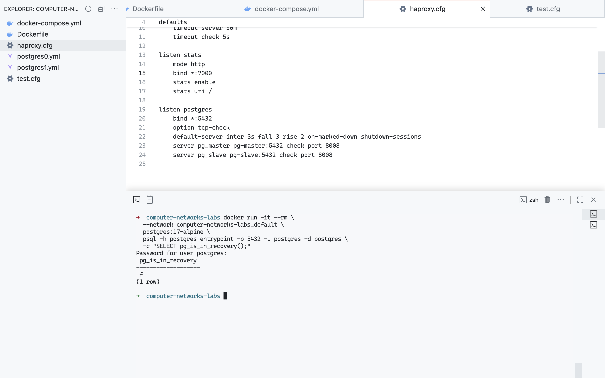

# ЛР 1

## Задача
Развернуть и настроить высокодоступный кластер Postgres с использованием Patroni и Zookeeper.  
---

## Часть 1. Поднимаем Postgres

### 1. Подготавливаем Dockerfile
Создаем Dockerfile с образом Postgres и Patroni.  

---

### 2. Подготавливаем docker-compose.yml
Определяем в `docker-compose.yml` сервисы для двух нод Postgres и ZooKeeper.  

---

### 3. Создаем конфиги postgres0.yml и postgres1.yml
Для каждой ноды подготавливаем собственный конфиг Patroni.  

  

---

### 4. Деплоим кластер
Запускаем проект и проверяем логи всех сервисов.  
Убеждаемся, что одна из нод выбрана мастером.  

  
  

---

## Часть 2. Проверяем репликацию

### 1. Подключаемся к нодам
Через `psql` или другой клиент подключаемся к `pg-master:5433` и `pg-slave:5434`.  

---

### 2. Создаем таблицу и данные на master
Добавляем тестовую таблицу и записываем данные.  

---

### 3. Проверяем slave
На `pg-slave` автоматически появилась та же таблица с данными.  

---

### 4. Проверяем readonly-режим
На slave пробуем выполнить вставку. Получаем ошибку (режим только для чтения).  

---

## Часть 3. Балансировка с HAProxy

### 1. Добавляем HAProxy в docker-compose.yml
В `docker-compose.yml` добавляем сервис haproxy.  

---

### 2. Создаем haproxy.cfg
Файл конфигурации HAProxy с балансировкой между master и slave.  

---

### 3. Перезапускаем проект
Запускаем контейнеры и проверяем логи HAProxy.  

---

### 4. Проверка подключения через HAProxy
Подключаемся к HAProxy (`postgres_entrypoint:5432`) и проверяем, что запросы перенаправляются на master.  

  

---

## Вывод
- Развернут кластер Postgres с использованием Patroni и Zookeeper.  
- Репликация работает: slave получает все данные от master.  
- Slave в режиме readonly.  
- Балансировка подключений настроена через HAProxy.  